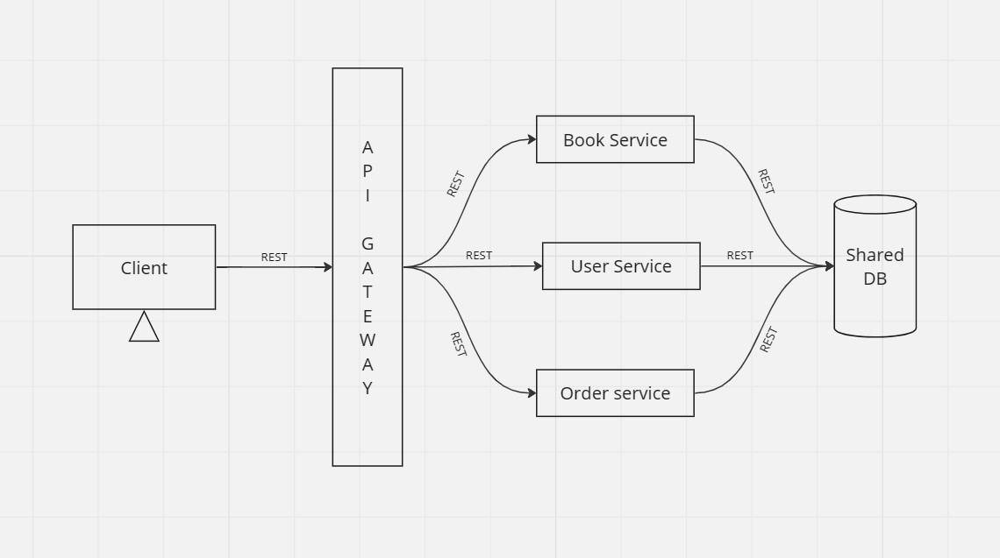

# Microservice Architecture + Shared Database

  

> This project is a simple example of a microservice architecture using NodeJS and MongoDB. It consists of three services namely: `users`, `books` and `orders`. The `users` service is responsible for managing users, the `books` service is responsible for managing books and the `orders` service is responsible for managing orders. The services communicate with each other using HTTP requests.

## Explanation
- 3 different services: `users`, `books` and `orders`
- Each service has its own server and a shared database
- The services communicate with each other using HTTP requests
- Client will interact with the services through the API Gateway

## Service Endpoints
- Users Service: `http://localhost:3001`
- Books Service: `http://localhost:3002`
- Orders Service: `http://localhost:3003`
- API Gateway: `http://localhost:8080`

## Working
- If client wants to interact with `User Service`, then it has to send request to this endpoint
  - `http://localhost:8080/user/api/{user-service-endpoint-name}`
- If client wants to interact with `Book Service`, then it has to send request to this endpoint
  - `http://localhost:8080/book/api/{book-service-endpoint-name}`
- If client wants to interact with `Order Service`, then it has to send request to this endpoint
  - `http://localhost:8080/order/api/{order-service-endpoint-name}`

## How to run
1. Clone the repository
2. Go to respective services and run `npm install`
3. Run `node start` in each directory to start the services
4. Go to the `api-gateway` directory and run `npm install`
5. Run `node start` to start the API Gateway
6. You can now interact with the services through the API Gateway
7. Make sure all your services are up and running